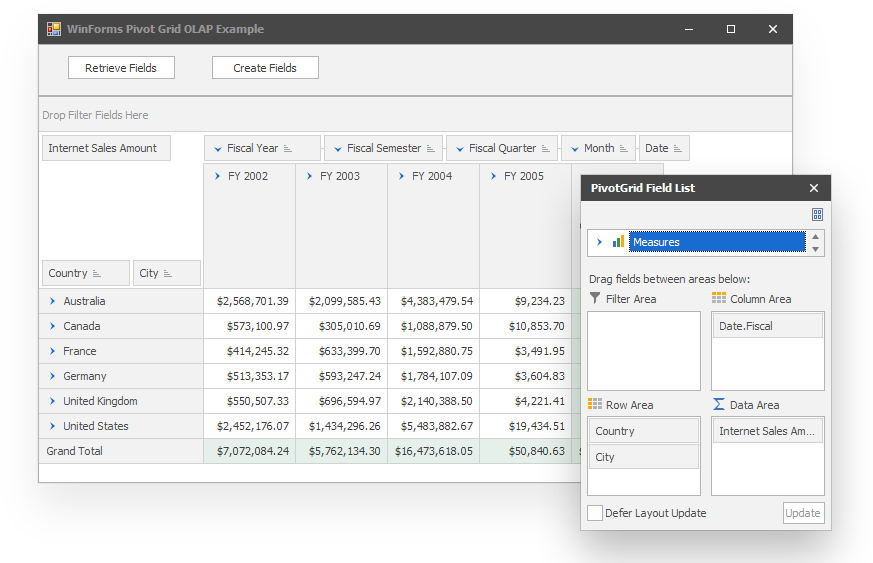

<!-- default badges list -->

[](https://supportcenter.devexpress.com/ticket/details/T344546)
[](https://docs.devexpress.com/GeneralInformation/403183)
<!-- default badges end -->
# Pivot Grid for WinForms - How to Connect the Pivot Grid to an OLAP Datasource


If you have a cube on the OLAP server (Microsoft Analysis Services), you can view its data using the [Pivot Grid](https://docs.devexpress.com/WindowsForms/3409/controls-and-libraries/pivot-grid). This example demonstrates how to specify connection settings and create fields that represent OLAP measures and dimensions.

To bind the Pivot Grid control to an OLAP cube, follow the steps below.

1. Set **ADOMD** as a data provider using the [PivotGridControl.OLAPDataProvider](https://docs.devexpress.com/WindowsForms/DevExpress.XtraPivotGrid.PivotGridControl.OLAPDataProvider) property.
2. Specify connection settings to the server using the [PivotGridControl.OLAPConnectionString](https://docs.devexpress.com/WindowsForms/DevExpress.XtraPivotGrid.PivotGridControl.OLAPConnectionString) property. The connection string used in the example is shown below.

```
OlapConnectionString="Provider=MSOLAP;Data Source=http://demos.devexpress.com/Services/OLAP/msmdpump.dll;Initial catalog=Adventure Works DW Standard Edition;Cube name=Adventure Works;Query Timeout=100;"
``` 

3. Create fields for all the measures and dimension in the bound OLAP cube. Use the [PivotGridControl.RetrieveFields](https://docs.devexpress.com/WindowsForms/DevExpress.XtraPivotGrid.PivotGridControl.RetrieveFields(DevExpress.XtraPivotGrid.PivotArea-System.Boolean)) method that creates fields, moves them to the specified area and makes them hidden. Another option is creating a new field and specifying its [OLAPExpression](https://docs.devexpress.com/CoreLibraries/DevExpress.XtraPivotGrid.PivotGridFieldBase.OLAPExpression) property.
4. Place the fields within the Pivot Grid Control areas ([Data Header Area](https://docs.devexpress.com/WindowsForms/1688/controls-and-libraries/pivot-grid/ui-elements/data-header-area), [Column Header Area](https://docs.devexpress.com/WindowsForms/1686/controls-and-libraries/pivot-grid/ui-elements/column-header-area), [Row Header Area](https://docs.devexpress.com/WindowsForms/1685/controls-and-libraries/pivot-grid/ui-elements/row-header-area) or [Filter Header](https://docs.devexpress.com/WindowsForms/1684/controls-and-libraries/pivot-grid/ui-elements/filter-header-area) as required and make them visible.

Use the invoked [Customization Form](https://docs.devexpress.com/WindowsForms/1805) to arrange fields.

For more information refer to the [OLAP Data Source](https://docs.devexpress.com/WindowsForms/11775/controls-and-libraries/pivot-grid/binding-to-data/olap-data-source) online help topic.



## Files to Look At:

* [Form1.cs](./CS/WinOlapRetrieveFieldsExample/Form1.cs) (VB: [Form1.vb](./VB/WinOlapRetrieveFieldsExample/Form1.vb))

## Documentation

- [OLAP Mode](https://docs.devexpress.com/CoreLibraries/403809/devexpress-pivot-grid-core-library/pivot-grid-modes/olap-mode)
- [Binding to Data](https://docs.devexpress.com/WindowsForms/1842/controls-and-libraries/pivot-grid/binding-to-data)

## More Examples 

- [WPF Pivot Grid - Bind a PivotGrid to an OLAP Cube (.NET 6.0)](https://github.com/DevExpress-Examples/wpf-pivot-grid-connect-to-an-olap-cube-net6)
- [ASP.NET Pivot Grid - Bind a Pivot Grid to an OLAP Cube at Design Time](https://github.com/DevExpress-Examples/aspnet-pivot-grid-getting-started-bind-a-pivot-grid-to-an-olap-cube-runtime-sample-t540972)

